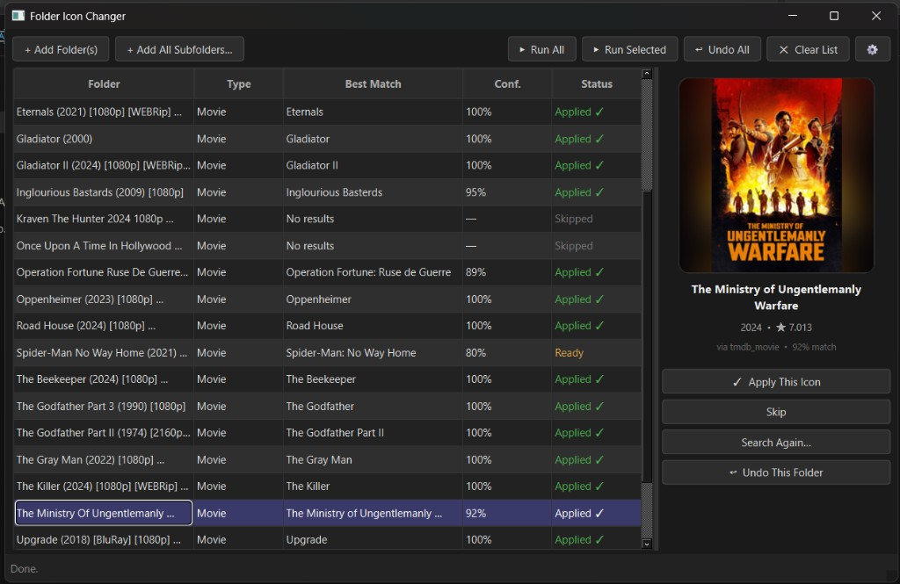
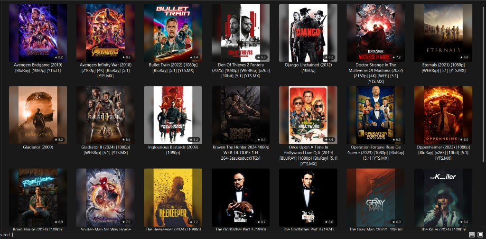

# Folder Icon Changer

A **Windows** desktop application that automatically sets custom folder icons pulled from real movie, TV show, game, and anime artwork. Drop in your media folders, click **Run All**, and every folder gets a polished poster icon — complete with optional rounded corners, a blurred backdrop, and a rating badge.

---

## Table of Contents

- [How It Works](#how-it-works)
- [Screenshots](#screenshots)
- [Requirements](#requirements)
- [Installation](#installation)
- [Running the App](#running-the-app)
- [Quickstart Workflow](#quickstart-workflow)
- [UI Reference](#ui-reference)
  - [Toolbar](#toolbar)
  - [Banners](#banners)
  - [Folder Table](#folder-table)
  - [Preview Panel](#preview-panel)
  - [Status Colors](#status-colors)
- [Settings](#settings)
  - [API Keys](#api-keys)
  - [Icon Style](#icon-style)
  - [Behavior](#behavior)
- [How Detection Works](#how-detection-works)
- [Search Sources](#search-sources)
- [Image Pipeline](#image-pipeline)
- [Icon Styles](#icon-styles)
- [Undo System](#undo-system)
- [Data & File Locations](#data--file-locations)
- [Caching](#caching)
- [Tech Stack](#tech-stack)
- [Project Structure](#project-structure)
- [Optional: Anime Upscaling (waifu2x)](#optional-anime-upscaling-waifu2x)
- [Troubleshooting](#troubleshooting)
- [License](#license)

---

## How It Works

```
Folder name
    │
    ▼
[Detector]  ──── regex pattern matching ────►  Content type (Movie / TV / Anime / Game)
    │                                           + clean title ("Oppenheimer (2023) [1080p]" → "Oppenheimer")
    ▼
[Searcher]  ──── TMDB / IGDB / AniList / Jikan ──►  Top-5 fuzzy-matched results
    │
    ▼
[Image Pipeline]  ──── download poster → upscale? → compose style → save .ico
    │
    ▼
[Icon Applier]  ──── copy folder.ico + write desktop.ini → set Win32 file attributes → refresh Explorer
```

1. **Detect** — the folder name is scanned against regex patterns (release tags, year formats, subgroup brackets, scene group names, etc.) to classify the content as a Movie, TV Show, Anime, or Game.
2. **Clean** — noise such as `[BluRay]`, `(1080p)`, `x265`, and the year are stripped to produce a clean search query.
3. **Search** — the right API(s) are queried and results are ranked by fuzzy-string similarity to the cleaned title.
4. **Process** — the best match's poster is downloaded, optionally upscaled (anime), fitted to a square canvas with a blurred background, styled, and saved as a multi-resolution `.ico`.
5. **Apply** — `folder.ico` is copied inside the target folder and a `desktop.ini` is written pointing Windows Explorer to it. The folder is flagged as a "system" folder so Explorer shows the custom icon.

---

## Screenshots

**App UI — folder list after a batch run, with the preview panel showing the selected match:**



**Result in Windows Explorer — folders with custom poster icons applied:**



---

## Requirements

| Requirement | Details |
|---|---|
| **OS** | Windows 10 or Windows 11 only. The icon mechanism (`desktop.ini` + Win32 file-attribute flags + `SHChangeNotify`) is Windows-exclusive. |
| **Python** | 3.10 or newer (3.12 / 3.13 recommended). |
| **Internet** | Required at runtime to query APIs and download artwork. |
| **Admin rights** | **Recommended** (not strictly required). On launch, if the process is not elevated, a dialog explains that icon changes may fail on protected folders and offers **Restart as Administrator** or **No** to continue. While not running as Administrator, an **amber banner** appears at the top of the window with **Restart as Administrator**. Applying icons without elevation can fail on protected paths; error messages may suggest trying Administrator (see [Troubleshooting](#troubleshooting)). |

---

## Installation

```powershell
# 1. Clone or download the repository
git clone https://github.com/your-user/folder-icon-changer.git
cd "folder-icon-changer"

# 2. Create a virtual environment (strongly recommended)
python -m venv .venv
.venv\Scripts\activate

# 3. Install dependencies
pip install -r requirements.txt
```

**`requirements.txt` pinned minimums:**

| Package | Version | Purpose |
|---|---|---|
| `PyQt6` | ≥ 6.7 | Desktop GUI framework |
| `requests` | ≥ 2.32 | HTTP downloads (posters, API calls) |
| `gql[requests]` | ≥ 3.5 | GraphQL client for AniList |
| `rapidfuzz` | ≥ 3.9 | Fuzzy-string matching for title confidence |
| `Pillow` | ≥ 10.4 | Image compositing and `.ico` building |
| `diskcache` | ≥ 5.6 | Persistent disk-based API + image cache |
| `keyring` | ≥ 25 | Secure OS-keyring storage for API keys |
| `python-dotenv` | ≥ 1.0 | Optional `.env` support |

---

## Running the App

From the project root (with your virtualenv active):

```powershell
python -m app.main
```

**Alternative (Windows):** run `launch.bat` from the repository root. It checks for Python 3.10+, can create a `.venv`, install dependencies from `requirements.txt`, and may offer to install Python via `winget` if no suitable interpreter is found.

The window opens immediately. You do not need to configure anything for anime (AniList requires no key). For movies and TV shows you should add a TMDB key first (see [API Keys](#api-keys)).

---

## Quickstart Workflow

1. Open the app (`python -m app.main` or `launch.bat`). If a dialog asks about **Administrator** rights, choose **Restart as Administrator** for the fewest permission issues, or **No** to continue.
2. Click **⚙ Settings** → **API Keys** → enter your TMDB API key → **Save**.
3. Click **+ Add All Subfolders…** and select your movies folder (e.g. `D:\Movies`). All immediate subfolders are added to the list.
4. Click **▶ Run All**. The app detects each folder's content type, searches the appropriate database, and auto-applies icons for matches above the confidence threshold.
5. Click a row to preview the matched artwork on the right panel. If the wrong title was matched, click **Search Again…** to open the manual search dialog.
6. Done. Refresh Windows Explorer (press **F5** in the folder's parent directory) if icons don't update immediately.

---

## UI Reference

The main window has a **minimum size** of **1200×620** pixels.

### Toolbar

| Button | Action |
|---|---|
| **+ Add Folder(s)** | Open a folder picker and add a single folder. |
| **+ Add All Subfolders…** | Pick a parent directory and add all of its immediate subdirectories at once. Ideal for a root `Movies/` or `Anime/` directory. |
| **▶ Run All** | Process and apply icons for every folder in the list that hasn't been applied yet. |
| **▶ Run Selected** | Process and apply only the currently highlighted row(s). |
| **↩ Undo All** | Revert every applied icon in the list back to the Windows default. |
| **✕ Clear List** | Remove all rows from the table (does not undo icons). |
| **⚙** | Open the Settings dialog. |

### Banners

Below the toolbar, one or both **information banners** may appear:

| Banner | When | Actions |
|---|---|---|
| **Administrator** (amber) | The app is not running elevated | Explains that icon changes may fail on protected folders. **Restart as Administrator** relaunches the app with elevation (same as the optional startup dialog). |
| **API keys** (purple) | TMDB and/or IGDB credentials are missing for searches that need them | Explains that movie, TV, and game searches need keys. **Open Settings to Add Keys** opens the Settings dialog. Anime (AniList / Jikan) still works without keys. |

If keys are missing for a given content type during **Run All**, affected folders are skipped with a status message. The **Search Again** dialog shows its own **API key** banner with links to obtain credentials when the selected content type requires them.

### Folder Table

Five columns are shown for each entry:

| Column | Description |
|---|---|
| **Folder** | Truncated folder name (full path stored internally). |
| **Type** | Detected content type: `Movie`, `TV Show`, `Anime`, `Game`, or `Unknown`. |
| **Best Match** | The title of the top-ranked search result. |
| **Conf.** | Fuzzy match confidence percentage (0–100%). Higher = more certain the right title was found. |
| **Status** | Current processing state (see [Status Colors](#status-colors) below). |

**Double-clicking** any row opens the **Search Again** dialog, same as clicking the button in the preview panel.

### Preview Panel

The right-hand panel shows:
- The poster image of the currently selected row's best match.
- The title, year, and rating pulled from the API.
- The source database and confidence score.
- Four action buttons: **Apply This Icon**, **Skip**, **Search Again…**, **Undo This Folder**.

### Status Colors

| Status | Color | Meaning |
|---|---|---|
| Pending | Grey | Folder added but not yet processed. |
| Searching… | Blue | Detection + API search in progress (background thread). |
| Ready | Amber | Search complete; match found; waiting for auto-apply or manual apply. |
| Applying… | Blue | Image pipeline running and icon being written. |
| Applied ✓ | Green | Icon successfully applied. |
| Failed ✗ | Red | Something went wrong (no image URL, write permission error, etc.). |
| Skipped | Dark grey | Match confidence was below threshold and no manual action was taken. |

---

## Settings

Open via the **⚙** button in the top-right corner of the toolbar. Settings are saved immediately on **Save** and persist across sessions in `%APPDATA%\FolderIconChanger\prefs.json`.

### API Keys

API keys are stored in the **Windows Credential Manager** (OS keyring), not in any plain-text file in the project directory.

| Field | Where to get it | Required for |
|---|---|---|
| **TMDB API Key** | [themoviedb.org/settings/api](https://www.themoviedb.org/settings/api) — free account required | Movies and TV shows |
| **IGDB Client ID** | [dev.twitch.tv/console](https://dev.twitch.tv/console) — create a Twitch application | Games |
| **IGDB Client Secret** | Same Twitch application page | Games |

The **API Keys** tab also includes a short note with **clickable links** to [themoviedb.org/settings/api](https://www.themoviedb.org/settings/api) (TMDB) and [dev.twitch.tv/console/apps](https://dev.twitch.tv/console/apps) (Twitch apps for IGDB credentials).

> **AniList** (anime) uses a public GraphQL API that requires no authentication. **Jikan** (MyAnimeList mirror) is used as a fallback, also with no key.

### Icon Style

| Setting | Type | Default | Description |
|---|---|---|---|
| **Icon style** | Dropdown | `Clean Poster` | Visual treatment applied to the poster. See [Icon Styles](#icon-styles). |
| **Rounded corners** | Checkbox | ✓ On | Apply rounded corners to the icon edges. |
| **Corner radius** | Spinner (0–64 px) | `12` | Pixel radius for the rounded corners. |
| **Show rating badge** | Checkbox | Off | Overlay a ★ score pill in the bottom-right corner. |
| **Icon resolution** | Spinner (128–512 px) | `256` | Size of the largest frame embedded in the `.ico` file. |

### Behavior

| Setting | Type | Default | Description |
|---|---|---|---|
| **AI upscale low-res anime images** | Checkbox | ✓ On | Use waifu2x to upscale small anime posters before compositing (requires waifu2x binary; falls back to LANCZOS). |
| **Auto-apply threshold** | Spinner (50–100%) | `85%` | When a search result's confidence is at or above this value, the icon is applied automatically without user intervention. |

The application uses a **fixed dark theme** for the entire UI; there is no light mode or theme toggle in Settings.

---

## How Detection Works

The **Detector** (`app/services/detector.py`) reads the raw folder name and scores it against four sets of regex patterns:

| Type | Pattern examples |
|---|---|
| **Anime** | `[SubGroup]` brackets, Japanese/Chinese Unicode characters, `OVA`/`ONA`/`Specials`, `Dubbed`/`Subbed`, `BDRip` |
| **Movie** | Year like `(2023)`, release tags `BluRay`/`WEBRip`/`WEB-DL`, edition keywords `Remastered`/`Extended`, resolutions `1080p`/`4K` |
| **TV Show** | `Season N`, `S01E02` / `S01` season-pack format, `Complete Series`, `Episode N` |
| **Game** | Scene group names (`CODEX`, `SKIDROW`, `FitGirl`, `EMPRESS`, `PLAZA`), `Steam`/`GOG`/`Epic Games`, version strings `v1.0`/`DLC`/`GOTY` |

The type with the most pattern hits wins. If the folder contains `.exe` or `.iso` files, the Game score gets a +2 bonus. If it contains more than 3 `.mkv` files, the Anime score gets +1.

After classification, the **title cleaner** strips all recognized noise tokens (brackets, resolutions, codecs, years, separators) to produce a clean title for the API search query.

---

## Search Sources

| Source | Content | Key required | Protocol |
|---|---|---|---|
| **TMDB** (The Movie Database) | Movies | Yes | REST |
| **TMDB** | TV Shows | Yes | REST |
| **AniList** | Anime | No | GraphQL |
| **Jikan** (MyAnimeList) | Anime (fallback) | No | REST |
| **IGDB** (Twitch) | Games | Yes (Client ID + Secret) | REST / OAuth2 |

All API responses are cached on disk for **24 hours** so repeated runs on the same folders don't make network requests.

When the detected type is `Unknown`, the app queries all four sources in parallel and returns the globally highest-confidence result.

**Fuzzy matching** uses `rapidfuzz.fuzz.token_sort_ratio`, which is insensitive to word order and handles partial-match cases (e.g. `"Inglourious Bastards"` matching `"Inglourious Basterds"` at 95%).

---

## Image Pipeline

The full pipeline (`app/services/image_pipeline.py`) for each icon:

1. **Download** — the poster URL is fetched with a 15-second timeout and saved to the disk image cache.
2. **Upscale (optional)** — if the image is smaller than 300 px wide and the content type is Anime, `waifu2x-ncnn-vulkan` is called with `scale=4` (images < 150 px) or `scale=2` using the CUNet model at noise level 2. Falls back to LANCZOS if waifu2x is not installed.
3. **Fit to square** — the poster is composited onto a blurred, darkened version of itself (the same "backdrop blur" technique used by Netflix and Apple Music):
   - **Background layer**: poster scaled to *cover* the square, centre-cropped, Gaussian-blurred (radius 18), and darkened to 50%.
   - **Foreground layer**: poster scaled to *contain* within the square, centred horizontally, and shifted 30% upward (so faces/titles remain prominent).
4. **Style decoration** — rounded corners, border frame, or glassmorphism overlay applied according to the selected icon style (see [Icon Styles](#icon-styles)).
5. **Rating badge (optional)** — a semi-transparent pill (`★ 8.7`) is drawn in the bottom-right corner using Segoe UI Symbol for proper star glyph rendering.
6. **Save multi-resolution `.ico`** — the composed image is downsampled and the following frames are embedded: `256×256`, `64×64`, `48×48`, `32×32`, `16×16`. Windows picks the right frame automatically depending on the view size.

---

## Icon Styles

| Style | Description |
|---|---|
| **Clean Poster** *(default)* | Poster on blurred background, rounded corners. Clean and modern. |
| **Framed** | Thin white border drawn around the poster edge. |
| **Glassmorphism** | Blurred, frosted glass border with a subtle white overlay ring. |
| **Rating Badge** | Same as Clean Poster but forces the ★ score badge regardless of the badge checkbox setting. |
| **Minimal** | Poster only — no rounded corners, no frame, no decoration. |

---

## Undo System

Before writing any file, the app records a **undo snapshot** in `%APPDATA%\FolderIconChanger\undo\<md5-of-path>.json` containing:
- Whether a `desktop.ini` existed before (and its full content if so).
- The original Win32 file attributes of the folder.

**Undo** reads this snapshot and:
1. Removes `folder.ico` and the new `desktop.ini`.
2. Restores the original `desktop.ini` (if one existed before the app ran).
3. Restores the original folder attributes.
4. Calls `SHChangeNotify` to tell Explorer to refresh.

This means running undo is truly non-destructive — folders with custom icons before the app ran get their original `desktop.ini` back.

---

## Data & File Locations

All app data is stored under `%APPDATA%\FolderIconChanger\` (e.g. `C:\Users\YourName\AppData\Roaming\FolderIconChanger\`).

| Path | Contents |
|---|---|
| `prefs.json` | Preferences saved from Settings (icon style, rounded corners, badge, resolution, upscale, auto-apply threshold). Older files may still contain a legacy `dark_mode` key; the current UI does not expose or change it. |
| `cache\` | `diskcache` directory for API responses and image file paths |
| `undo\` | Per-folder undo snapshots (`<md5>.json`) |

API keys are stored in the **Windows Credential Manager**, not in this directory.

---

## Caching

| Cache type | TTL | Key |
|---|---|---|
| API search results | 24 hours | `api:<source>:<md5(query)>` |
| Image files (local path) | 7 days | `img:<md5(url)>` |

Cached images are stored as `.png` files in the `cache\` directory. The cache is managed by `diskcache` and is safe to delete manually if you want to force a fresh fetch.

---

## Tech Stack

| Library | Version | Role |
|---|---|---|
| **PyQt6** | ≥ 6.7 | Desktop UI framework (widgets, threading, signals) |
| **Pillow** | ≥ 10.4 | Image download, compositing, `.ico` generation |
| **rapidfuzz** | ≥ 3.9 | Fuzzy title matching (`token_sort_ratio`) |
| **requests** | ≥ 2.32 | HTTP API calls and image downloads |
| **gql[requests]** | ≥ 3.5 | GraphQL client for AniList |
| **diskcache** | ≥ 5.6 | Persistent disk-based cache |
| **keyring** | ≥ 25 | Secure OS-keyring API key storage |
| **python-dotenv** | ≥ 1.0 | Optional `.env` file loading |
| **ctypes / Win32** | stdlib | `SetFileAttributesW`, `SHChangeNotify` |

---

## Project Structure

```
folder-icon-changer/
├── launch.bat                   # Windows launcher: Python check, venv, pip install, run app
├── app/
│   ├── main.py                  # Entry point — QApplication, optional admin relaunch + MainWindow
│   ├── config.py                # Preferences (load/save prefs.json), API key keyring wrappers,
│   │                            #   cache_dir() and undo_dir() path helpers
│   ├── resources/               # Optional: icon.png (window icon when present)
│   ├── api/
│   │   ├── tmdb.py              # TMDB REST calls (search_movie, search_tv, poster_url, …)
│   │   ├── anilist.py           # AniList GraphQL search + best_image_url
│   │   ├── jikan.py             # Jikan (MyAnimeList) REST search, title helpers
│   │   └── igdb.py              # IGDB OAuth2 token + game search, cover_url
│   ├── services/
│   │   ├── detector.py          # Regex-based content-type detection + title cleaning
│   │   ├── searcher.py          # Orchestrates API calls → SearchResult list with fuzzy ranking
│   │   ├── image_pipeline.py    # Download → upscale → compose → build multi-res .ico
│   │   └── icon_applier.py      # Write folder.ico + desktop.ini, Win32 attrs, undo support
│   ├── ui/
│   │   ├── main_window.py       # MainWindow, toolbar, folder table, worker threads
│   │   ├── preview_widget.py    # Right-panel poster preview + metadata labels
│   │   ├── search_dialog.py     # Manual search override dialog
│   │   └── settings_dialog.py   # 3-tab settings dialog (API Keys, Icon Style, Behavior)
│   └── utils/
│       ├── cache.py             # diskcache wrappers (get/set, image path helpers)
│       ├── fuzzy.py             # clean_title() + best_match() using rapidfuzz
│       └── upscaler.py          # waifu2x-ncnn-vulkan wrapper with LANCZOS fallback
├── docs/
│   └── screenshots/             # README screenshots (e.g. app-ui.png, result-explorer.png)
├── requirements.txt
└── README.md
```

---

## Optional: Anime Upscaling (waifu2x)

For anime posters the source image is often small (150–300 px). The app can use `waifu2x-ncnn-vulkan` to upscale before compositing, producing sharper icons.

**Setup:**

1. Download a release from [github.com/nihui/waifu2x-ncnn-vulkan/releases](https://github.com/nihui/waifu2x-ncnn-vulkan/releases).
2. Extract to `resources/waifu2x-ncnn-vulkan/` inside the project root:
   ```
   resources/
   └── waifu2x-ncnn-vulkan/
       ├── waifu2x-ncnn-vulkan.exe
       └── models-cunet/
           └── ...
   ```
3. Enable **AI upscale low-res anime images** in Settings → Behavior (it is on by default).

If the binary is absent, the app automatically falls back to Pillow `LANCZOS` resampling — no configuration change needed.

---

## Troubleshooting

**Icons don't appear after applying**

- Press **F5** in Explorer or navigate away and back.
- If it still doesn't work, open a folder's Properties → Customize → Change Icon... and point to `folder.ico` manually once to force a cache refresh.
- On some systems you may need to clear the Windows icon cache:
  ```powershell
  ie4uinit.exe -show
  ```

**"Applied ✓" but the icon is still the default yellow folder**

- Ensure the folder is not on a network share or a drive with a file system that doesn't support NTFS alternate streams. The `desktop.ini` mechanism requires NTFS.
- Use the startup **Restart as Administrator** option, the **amber banner** in the main window, or relaunch the app as Administrator. Permission errors when applying an icon may say to try running as Administrator.

**Movies/TV shows return no results**

- Make sure your TMDB API key is entered in Settings → API Keys. Without it the app cannot query TMDB.

**Games return no results**

- You need both an IGDB Client ID **and** Client Secret. These come from a Twitch Developer application, not from IGDB directly. Visit [dev.twitch.tv/console](https://dev.twitch.tv/console).

**Slow first run**

- The first search for each folder hits the network. Subsequent runs for the same folder names are served from disk cache instantly.

**Low confidence matches / wrong title matched**

- Double-click the row (or click **Search Again…**) to open the manual search dialog. You can type a corrected query, change the content type, and pick from the result list.
- Lowering the **Auto-apply threshold** in Settings → Behavior (e.g. to 70%) will let more matches apply automatically, but increases the chance of incorrect icons.

---

## License

Add a license file if you distribute this project (e.g. MIT, GPL-3.0).
